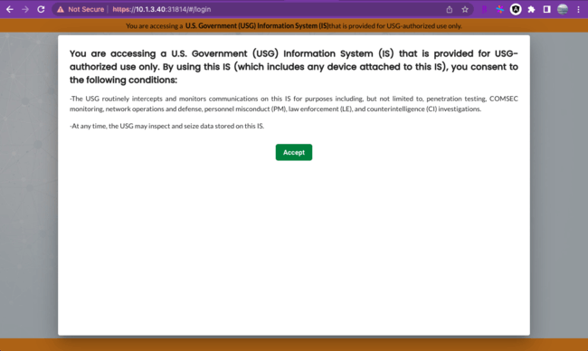
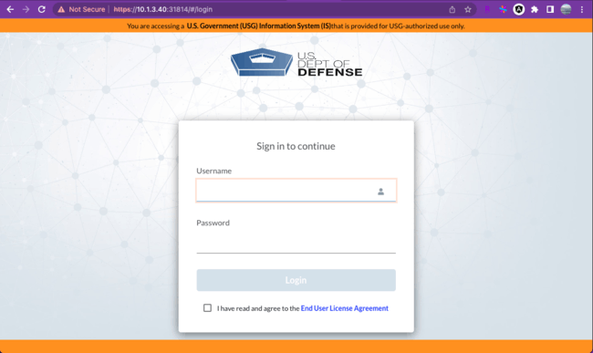
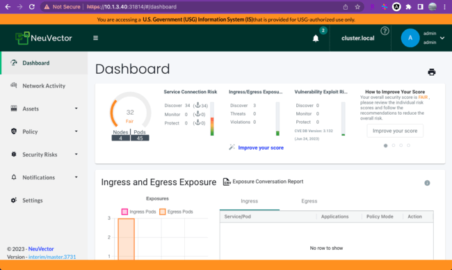

# Customizing the UI Component

This guide will help you customize the UI component with the following options:

## 1. Customize the Login Logo

To customize the login logo, follow these steps:
- Create a 300x80 pixels SVG file.
- Base64 encode the SVG file.
- Save the encoded file to the environment variable `CUSTOM_LOGIN_LOGO`.

## 2. Customize the Policy

To customize the policy, follow these steps:
- The policy content can be plain HTML or text.
- Base64 encode the policy content.
- Save the encoded content to the environment variable `CUSTOM_EULA_POLICY`.

## 3. Customize the Page Banner

To customize the page banner, follow these steps:

### Header Customization

- Customize the header's content and color.
- The color of the header banner is required.
- The color value can be a color keyword (e.g., yellow) or a Hex value (e.g., #ffff00).
- The content is optional and can be one line of plain HTML or text with a maximum of 120 characters.
- Base64 encode the header content.
- Save the encoded content to the environment variables `CUSTOM_PAGE_HEADER_COLOR` and `CUSTOM_PAGE_HEADER_CONTENT`.

### Footer Customization

- Customize the footer's content and color.
- The color of the footer banner will be the same as the header banner if the color is not customized.
- The content is optional and can be one line of plain HTML or text with a maximum of 120 characters.
- Base64 encode the footer content.
- Save the encoded content to the environment variables `CUSTOM_PAGE_FOOTER_COLOR` and `CUSTOM_PAGE_FOOTER_CONTENT`.


The environment variables (`CUSTOM_LOGIN_LOGO`, `CUSTOM_EULA_POLICY`, `CUSTOM_PAGE_HEADER_COLOR`, `CUSTOM_PAGE_HEADER_CONTENT`, `CUSTOM_PAGE_FOOTER_COLOR`, `CUSTOM_PAGE_FOOTER_CONTENT`) can be defined in the `values.yaml` file in the [helm chart](https://github.com/neuvector/neuvector-helm/blob/master/charts/core/values.yaml). The corresponding section in the `values.yaml` file where these variables can be defined is "manager.env.envs".

## 4. Example to customize the UI pages using helm chart

### Prerequisites

Before customizing the UI component, ensure that you have the following:

- NeuVector Helm chart repository: [https://github.com/neuvector/neuvector-helm](https://github.com/neuvector/neuvector-helm)
- NeuVector installed on your Kubernetes cluster

### Steps

Follow these steps to customize the UI component:

1. Locate the NeuVector Helm chart repository in your local environment: [https://github.com/neuvector/neuvector-helm](https://github.com/neuvector/neuvector-helm).
2. Navigate to the `neuvector-helm/charts/core` directory.
3. Edit the `manager.env.envs` in the `values.yaml` to add the environment variables.
   - `CUSTOM_PAGE_HEADER_COLOR`: Set the banner color to DarkOrange (#ff8c00).
   - `CUSTOM_PAGE_HEADER_CONTENT`: Specify the header text using a plain HTML or text, for example "```You are accessing a &nbsp;<b> U.S. Government (USG) Information System (IS) </b> &nbsp;  that is provided for USG-authorized use only.```", remember to based64 encode it.
   - `CUSTOM_EULA_POLICY`: Customize the policy content using a plain HTML snippet or text and remember to base64 encode it.
   - `CUSTOM_LOGIN_LOGO`: Customize the logo with a 300x80 pixel svg file and base64 encode it
```yaml
manager:
  # If false, manager will not be installed
  enabled: true
  image:
    repository: nvpublic/ma
    hash:
  priorityClassName:
  env:
    ssl: true
    envs: 
      - name: CUSTOM_PAGE_HEADER_COLOR
        value: "#ff8c00"
      - name: CUSTOM_PAGE_HEADER_CONTENT
        value: WW91IGFyZSBhY2Nlc3NpbmcgYSAmbmJzcDs8Yj4gVS5TLiBHb3Zlcm5tZW50IChVU0cpIEluZm9ybWF0aW9uIFN5c3RlbSAoSVMpIDwvYj4gICAgICB0aGF0IGlzIHByb3ZpZGVkIGZvciBVU0ctYXV0aG9yaXplZCB1c2Ugb25seS4= 
      - name: CUSTOM_EULA_POLICY
        value: PGg0PgogIFlvdSBhcmUgYWNjZXNzaW5nIGEgVS5TLiBHb3Zlcm5tZW50IChVU0cpIEluZm9ybWF0aW9uIFN5c3RlbSAoSVMpIHRoYXQgaXMgcHJvdmlkZWQgZm9yIFVTRy1hdXRob3JpemVkIHVzZSBvbmx5LgpCeSB1c2luZyB0aGlzIElTICh3aGljaCBpbmNsdWRlcyBhbnkgZGV2aWNlIGF0dGFjaGVkIHRvIHRoaXMgSVMpLCB5b3UgY29uc2VudCB0byB0aGUgZm9sbG93aW5nIGNvbmRpdGlvbnM6CjwvaDQ+CjxwPgotVGhlIFVTRyByb3V0aW5lbHkgaW50ZXJjZXB0cyBhbmQgbW9uaXRvcnMgY29tbXVuaWNhdGlvbnMgb24gdGhpcyBJUyBmb3IgcHVycG9zZXMgaW5jbHVkaW5nLCBidXQgbm90IGxpbWl0ZWQgdG8sIHBlbmV0cmF0aW9uIHRlc3RpbmcsIENPTVNFQyBtb25pdG9yaW5nLCBuZXR3b3JrIG9wZXJhdGlvbnMgYW5kIGRlZmVuc2UsIHBlcnNvbm5lbCBtaXNjb25kdWN0IChQTSksIGxhdyBlbmZvcmNlbWVudCAoTEUpLCBhbmQgY291bnRlcmludGVsbGlnZW5jZSAoQ0kpIGludmVzdGlnYXRpb25zLgo8L3A+CjxwPgotQXQgYW55IHRpbWUsIHRoZSBVU0cgbWF5IGluc3BlY3QgYW5kIHNlaXplIGRhdGEgc3RvcmVkIG9uIHRoaXMgSVMuCjwvcD4K
      - name: CUSTOM_LOGIN_LOGO
        value: PHN2ZyB4bWxucz0iaHR0cDovL3d3dy53My5vcmcvMjAwMC9zdmciIHhtbG5zOnhsaW5rPSJodHRwOi8vd3d3LnczLm9yZy8xOTk5L3hsaW5rIiB3aWR0aD0iMzAwIiBoZWlnaHQ9IjgwIiB4bWw6c3BhY2U9InByZXNlcnZlIiB2ZXJzaW9uPSIxLjEiIHZpZXdCb3g9IjAgMCAzMDAgODAiPgogICAgPGltYWdlIHdpZHRoPSIzMDAiIGhlaWdodD0iODAiIHhsaW5rOmhyZWY9ImRhdGE6aW1hZ2UvcG5nO2Jhc2U2NCxpVkJPUncwS0dnb0FBQUFOU1VoRVVnQUFBU3dBQUFCUUNBWUFBQUNqNmtoN0FBQUFBWE5TUjBJQXJzNGM2UUFBQUFSblFVMUJBQUN4and2OFlRVUFBQUFKY0VoWmN3QUFMaU1BQUM0akFYaWxQM1lBQUJNa1NVUkJWSGhlN1owSmNCVFhtY2ZGWVNmWXNVSENJTUI0Y1dYSlJXMGx1MGdDY1JoaGM1clRYTVlHWmtaSVNHQWtJUVRtQ29UaHhpQXcwUWtDb1lOYjRoSUNaMnMzNjlpMW0xMG5YbnNyanJOeHRyeDJzcldwcmRpTzQ2elhqdTBZNlAxL1Q5K01lOTYwUmoyamthYWwrWDVWLzVwNTczM3Z6ZXNldmIvNlRYZS9UaEFFUVJBRVFSQUVRUkFFUVJBRVFSQUVRUkFFUVJBRVFSQUVRUkFFUVJBRVFSQUVRUkFFUVJBRVFSQUNtYnV1NW9FRkcwN3ZtTC9oMU0yRm04NFlwRVdiemh4YnNQRzBoME1FUVJCaXcyTWI2bWM5OXZTcEMvTTJuRExtYnpodHpOOTQyb0E1S1prTXkxaTArYXp4T0dtTDBnc0x0NXd1NFNZRVFSQTZoamxyYXl2bnJLLy82ZHoxOVFhTVNta2VLUXpEV2t6NjdqbmpDYi9PdnIxNDg5a0cvZ2hCRUlUdzhYcTlQV2NVMWI0MXE2anVnOW5yNm93NTYrcVZ5S3lpYVZoUGJpV2RONVpzYTlIU2JlZisrT1MyQzI5eU53UkJFSUtaVzFqYmI4YWFtcHN6MTlZYXBGbWtvanBqTnFsVERRdjYzZ1ZqR2N1MVhiMStrbHRWZFFkM1ZSQ0VlT0tSbFhYM3p5aXNuakI5VFkzeEtHdEdZWTB4czdERnJKeG1XSzd0RFliYjJ5S1B0OUh3N0dnd1hQdXVmSDJwOXdmMzhpWUpndEE5TUhwTVczWDhvU241MVRYVDhxdU5hZmtuamVrRnJDNXJXSTFHSm1sbm83Rjg1MFZqK2E2TFJ2YWVpNHV5ZGw4YXhoc3RDRUtYd0RCNlRNbzc0Wm04NnZqdnA2dytZVXpKcTFhYXFzeXEreHBXRml0Nzk2VVc3Ynk0Sm52M3hZbThWd1JCY0FLVDg2cUhQTHpxK0U3bzQwbFBIVGNtUFhYQ21BeWpJc1d6WWEwZzdTRmRObkwya2k3VjUreSt1cEozbXlBSW5jR0VGVWZuVGN5dHFwMjRzc3A0bUxUcXVQRUlTWm1WR0ZacmhwV3JkTVZZdWE5RnVmdXV2TFJ5LzVWbmVMZkdqUDc5KzcrYm1KZzRnNU4yNkkwNk4vbTlKZmZjY3c5Qyt2L2pmZmZkWitEMVRlZ0UzajlQYWVnbVZNR2hnaEJkeG1VZnJacVFjK3dWeU1qSWJSR1psUmhXK3d3TFptV3MybjlWNmFsbm9QMVgvM1AxTTAzUDgyN3ZOR0FtNy9mcjEyOG1KKzNRbTR5SDN3ZUI5djRKNWIvRjI1NHRPY0dnZkJhM0lXZGVoZll4TnJ2OForT3lLdjg0ZnNWUjR5RlN6bEdEek1ycGhnVjlPbi9EMmE4dExHcm93NXZpbzhmODlXZUdMZGg0cHQ3SmhyV2FkS0RKeUdPdFBuRDFJN3krVHRlajhYWjBDTkUyTEpUZDVyY2hHVFJvMElCUTdRaENFRk9XRmQrZG5sbCthMnhXcFVFYWw5Mmk4ZGxIRGNjYjFycjZEK2tNSkcrS245R3VpdmxwcmxJMWFFWXRLMzBrMVYzU3FBbzBudHh5TnNQSmhwVjNzTW5JUDNqTnlDKytaaFJBYTRxYmpZS0R6VGNiRzQxZXZBbFJJWnFHaGJhR1FIL2laSnRRTzBsSlNlbWNGSVF2U1BPVUR4cmpLcHMxT3JQY2dFa1o2Y3NyakRFc3h4dFdVZTE3YzRycS9vRTN4Yy9mTENrZmxycXNaSCthdTh3SWtNbXdMTXJlR3UwNThtQ0NkdVN5ZU92NUI1WnNPL2YyMG0zbmJqclZzTlljYWxFaDZmQjFZeTFlMTVmY1NDa29pZng2c0E0NHdwS2pKaUV5dnVNK2ZEOE4wbEVlVXJreG10UUZER3RHWWUyck05YldWUEptK0VseGxZOVBkWlg4T01pRWRJVXlMRTFvNzhNVVQ5bkVzVmtIN2xFZndpenlOdDRKdzNwaDJmZk92K3RZd3lJOWU5MG9JaDI1WWF5RHVQdTI2UUREbWtubGFGY3U2UkRzaytMK2ZoRzlZdkIrNW16RE9tazhXbml5RWEvTFZjY1ordTBteFYzcVRuT1h2bTVsTkNFVmhtRlpDU2FXbGJxODhxdXFJeWFXYnJ0UTV2RTIvSXR6RGF0NUhYZlZOdEUyTEIrSXlZR3VRcmZad1BZTkdEREFNMnpZc0M5emlDQjh3VWgzeVlyeEdIVHBPTXB5bW1GTnphdmVOWFhOaVJUdXFtTEVvdkt2cExwTHZTbXUwdmV0VENRc3RkT3dkTUhBU2thN3lvTk8vWHQyTlQ2eGZHZmpjYWNZRnZVSlpiOVRuYk5KUnhtV0ZmaXNOR2dIRzloclE0Y08xVStRQ1BGS2lydGtJY3hJL1FDYTVpbDl6U21HcFRvSDBoY2U3Z09EcW9NaDNOWU5vdDJLc21IcFN2V1VOYVM0U3ZhcURXRmlibGlIcjgramZsQys2cEJOWUJ5L2cyWnowZzUzUkdwWVpwS1Nrb1pTTzFEQVB5NGhUa2xkVWpxWnpPaWh6R01qTTNEMDRoVERtcHAzWW9ucTM3TFNYMXFaUVNSQ1czVTRDc3JJeVBEMlZodHZ3Y2hsNWFQVGNOU0orS2daWktxNzVCQzFuYm56WW1Pc0RZdjZrWGZ3MnEvQ05Td1lSalBNdzgxSk85eUpPaC93K3dCZ2ZKL3hXMXVnbmNXbzh3a25oWGhtcEtjeVJSbFdkdVdmS1QzS1UzckZLVk5DMVVHdnQ2ZVZDYlFsR05ON2RKWXZ3MVBidnQ5QzhQbGo2Q3dqcHFGV24yTkgzRkpDektlRWg1dlY3MzhVSDhFUjFpWVloL29ic1FQaTM0SmU1R1FBYU9kLythMHRZSlRmUXAydytpdDBVOUtYbFE5WGhnWFRtWmhUdVlEeW5HSlkwd3FxbjZYK3BIcktYVlpHNEZPcXEvVHpzVm5WQVdmdk9vT1JydEpmV1BYSHJOVE1pdmtVbTdtajRkOWliVmpVajVYN0xyOFlpV0VSWkJvd2o5R2NERWtiQnRNckhBT0M4ZjBNMnNCSklaNUpjNVgxOXhrV0dRdmxqWEtYblhHQ1lkRVpRdFZKb0FhL3UrenpWRmZacjlNODVVczUyMUdrNUZiZGtlWXVmUlZIWSs4b3czS1YzYUw4WmNXbjdvNzFXY0xDSTlmbm9DczlxTDFJRFl1QTBYd08wMXJEeVNBR0RoejRiZDJNcUE1VXcwbEZuejU5Zkw5TmpVUXk2TUplNHQ1NzcwMkNVZDFDek45ekZyWDFHK2h6VGdyeHh2Q0NraStaRFF0R3NwanluV0pZT01wNlczVzBDK1BlMGZEcldCcFdZWEd6T3FtQ3o3dmVYc01pQmd3WXNCQ204Vk9JRE1jdm1NdlBZV1paSE9hSHkrczVHUUR5WjZMZWozMXQrSVM4VC9FYWRNOGs4bjVMNVp3VTRnM2RzTWhBS0I5SFdSVk9NQ3p6VVZaWHhMVzV2bitzcjhQS1AzejlPNHNXTmZhaXo0bUdZUWxDek5BTmkweGpXbDdOTkNwTHp5eTc3UVREbWxadzhqWFYyUzZJWjBmam4yTnFXSWVhMzZWKzRDanZxaGlXMEMzUURZdHVnYUg4ZFBmMzV6bkJzT2hLZDlYUkxzYkNvc045WW4ybCsvcml5d085M2hkNjAxWDNBWVoxc1BuZnVadTJ3RFJzTFZUYmltb3doYk4xaXcxaXZWcmROc1ZWL1ZqRmFLTCtQTXpoZnBCSEY2TmF4WWNVcHNDTHVJbXdTRTVPdmh2MTYvQzViK0hWTjlYOURHcUExR1U3b2ZCOXZoMmh2Vkt1MXYxSno2ellwUnZXN0lMajZ1NTRweGpXOUlLYS8xS2Q3VUxFL3RhY2EzK2dmaXpkZXVHNmJsaTBSTFhxcEUwd2FKOUxTa3JLSHpod1lMSlp5THNmR29VQk14SDZDUVlQRGNybnVGb1FLSDhGV29mQlBOQ3V1S29mK2d5OUgyYWgvR3ZvdzhQY2wvL21hdXBIZkt2MlNSUnJsVS9DdG4rRm03REY0TUdENzBKN3Q3RmZYdTdidDIvUXJWdWdGOHJtY2YrT2MxNFFvZnFrQzU5NUgxZUxBN3plbmtHR1ZWU25qbXBTTXlzZWNJSmhVWittckQ4VjlNZnJWT2dleDFnYkZ1amg5Um85YVZXSkFNTTYwQlQyUlpoc1dMWXVITzNYcngrZEtWUjNFZWdnbnd4ckJTY2pnZ1l5djIwVHhPNkhLWHpFeVZZSnA4MVFZQi85aU51eXRid1Ara2Fyckg3SXlRQ2kxYWR1eVlUc3lqTzZZYzErdXU3YlZPWVV3NXBSZVBKVDFka3VnSHQ3NHlleE5penF4NkxOWjEvUURhdlFlN1dmNm1RWWhHTllEQjFsQkEwNDVIV3FZUkVVVDBjOW5MUWszRGF0UUJ1NWtiU0RPb2VzNmtXalQ5MGEzYkJvcFU3S3B4VUpuR0JZcEpsclQwNmVYbkI2NlBTTjFwb1hvWlpheWF2cnNpMjV2STEvRWV2bFplaDNLem96dUhqTE9iWFFvTit3OWw2MnZYQ2VtUWdNaTQ0ZVBzT2dLK2FrQXVtWUdCYjY4azFPV2hKdW0xWlFHNWdDSm5JeUxGQ1gxckNuYTlMOFJLTlAzWnFIVng3N2tXNVk4emFjcGdzT0U5S1hsMy9pQk1NeXI0ZGxhOFZSYklONWllU3V2cWE3UGNPNjlodjZ6aFpzUFBWeXNHRTFqYUN5Y0luRXNERGd2ZzZqK0Q5T0twRFgyWWJWaytORExpRWRacHRCWU4vTWIwOGJxSDhBK3lyZ29SM3Q3VlAzeHpCNjZJYTFjTk5wOVZzRTNjSWpodFUxREN1M3FsbE5mMmo3eklhRnp3djVGSnRRUkdKWUlHaUpHYVE3MWJCZ0FoOUFsdmMwbW1tdk9lQXp6cU9OZzV5TUNMMFA3ZTFUWEFBRGVUblFzTTdnai81OElaV05YVjd4dWhpV3N3MEwraUY5VjNPSzZ0N1FEU3RuNTVVTUtvdUVDQTNMYWhDK2dzRjlBKzN0c1NPdUZnQzFpVFoydEtHWE9PNHByaGFTOXBvRFB1ZWYwVVk0ajBFTFF1OERwYTMyaVM3RXRlc2ZRSmVHVmpmUURRc0RWaDFscGVSVzNTV0c1V3pEeXZDMkxKMUQyNjRiRnVWSENnWkdKSVlWdENZVzBsRTV3a3BNVEh5Z05jRTh3cjRSWHU5bnVPQXpMNkNOL1p5TUNMMFA3ZTFUM1BEb21wTnZhSVpsTE5sNlFmMjNHNU5WOFp3WWxqTU5LNys0U2ExdlAyTnQ3Y3U2WWJtM045ZzYwbWlOU0F3TGcvZ2JHSFR2YzFLQmRLZi82RzZIOXJhSitvdmIwd2IyMVY1SWZzT0toUFNpaGo2NllkR2dWSVZlYjA4eExHY2FGbDEzUlY4UjdSZmRzTlIzMXc0aU1Td011RnNZaEFGR2lieHVhVmdFdFlGOUZOR1RpVkNYVnJRSVdGVzFJN2F6MndJaitMMXVXQmlJYXVYTWNka1ZsOFN3bkdWWWVjVk5CK2k3bVo1LzhtK0RER3ZyT2N1VkVzSWhYTVBxMjdmdlgyUEFxZVYxekNDdjJ4b1dwcVBySTJrSCszVy9WYjJPMk01dUN6MFpXVGNzR254Y0ROTVN3M0tTWWZIWGtqQU4rMHMzTEM1cUYrRVlGbzZxZm9qQlpubEdFdm5kMXJBSWJQdUwzSmF0SjNFajloRHFCRno2NGFNanRyTmI4OWpUOVovcWhvWEJ0cFBLeG1hVzFvaGhPY093a0ZZM3ZrNWVmZnlDYmxqWW5oOVFXWHNodzZMcDNkQ2hRNVBNR2pKa1NIOE1MTHAzYnlKZWYwV0RETzkzYzdVZ1VFNkdWYWkzRTBwYzFROTlCcitOR3RGc0U4YXVGaWZFSzUwTkhjVFpBYUI4RnNWQVp6a3JpR2oyS1M2WXQvYllZTjJ3YUdCeGNZSVlsak1NcStYYk1IcE13bjdVRGF1bHJQMWc4QlJCcmEwVWNCS0RVeTJ2M1JhSWo4cHFEZncyYW5SRW0zUkRNcWpIL3ZrSXIrYkZDZW1NNG5jNXJGVVFFL1UrZFh1c0RDdG4zNVd0VkRZMnF6eEhEQ3ZHaHZYTXRiWDBYVXpJT1Zxakd4YTJ0Y3V2MWlvSVlmSDRsbE4vcFJzV0RSNHVUaEREaXAxaDRYM0xpZ2lHMFlQMnQyNVlxa3dRNGcwcncxcDk0Sm82cEIyVFcvVk5NYXdZR2RiK3BnbjBIWXpOcXFqU0RXdk91anJMNVYwaWhYN0RNazlyV2hPbU8rOUNMdzYxOGJSbXEvcDJ4VTM0c1lxeG9aOXdkWVZGdVMxaDMrUnpFMzRzNGtLdTU0WjlWbXFPeHhUN0tCZFpRVThkVW11UHRTYjZEamcyQ0xwQjI2cU9IWEVUenViSkxXY3pkTU9pNjM2NE9DRmo1ZEVISTlVMHYycGJWQmllNXJhbFRhRzFlTlA1OE9YOVFwNklkVlZwSldsL1pPTGRuekF1cTFMOWd6QWIxdlNDa2k5eGNWU3dhMWlhYmtQS1ZLM1FZc01TTitISEtzYUdPdE93eUVSYVBRRmkxN0FROTVvNXJpMGhYajBxejB5M055ekN5ckFLRGpWWGM3RVFJOUxkRmJWV2hzWEZVU05DdzFMQ29MSDhPN0dLdFN0dXdvOVZqQTExcW1HUnNDKyt3U0VCMkRFczVBY2RWZUd6eDNPeEFubjB0S0dBR0xRZGNQRnVYQmlXYTl2NUpicGgrUjdPU1k5K0grVXVNOVJqN3ZYSGcyVzFyS1BsdnpyZS81dVhlZnFvVFIxOTAwWU1RRFZsekd1Wk1yWk1GOVZES2RSVTBXcWFPS3VvMWpROXJBdVlHcHFuaFVGVHdzMW4xSFJRVFFVaHkybWdid3FvVC8vOFV6OU0rNkNXYVo5NXltZWE3dkZVYnhWUDlmUnBucnBxSGZwaXFSaCttTVJoZm5venRPN0lEZjhmRGozMFZqZXM2UVhIL3BLTG80WnVXQmhRSDNOUkVCZ2c3NWhqU2FpdkhteGlSbytCbnVDaXNOSGI0dXl3aUVZYlB2UzJ6RXBPVHI2YncvellOS3lBZGpnN0NKVE5EQlZyWlZoYzFMMFF3K29haHNWRlVTVWN3eUl3QU44eng1TzR5STllRHNXRllaRTR6RThraG9XWWIzR1JUaTk4WDd2TjRueEYvQmlXdDJHUEdKYXpEV3RLUWZWVUxvb3E0Um9XVUkrak4ydkVpQkYzY3BsQ0w0ZTZyV0ZoLzlHdFN2NDBEQ3BnNVZjN2hvV1lOODB4UGlGL0QwUlA0YkYxZFgzY0dCWWhodVZzdytMc3FCT0JZUVVOV2d5cXVWeWswTXZ0aXFzSFlCVVhTbHd0QUtzNEd6ckQxUVBRNDRZTkcvWmw3TE1zY3g3MngzOXd1QzNESWhEM0ozTmNLN3FOdUYxNEhjelZBb2owTnl4Nk9nODMwWFhJMlgycFhnekxtWWFGZmJpUnM2Tk9OQXdMZFJaeWtVSXZ0eXV1SG9CVlhDaHh0UUNzNG16SXRtRnhQdDJhWkM1VGE5N2JOU3dDWlFzUWM4c2MzNXJRN2p1b0V2Qkl0N2d5TExvRlJBekxtWWJGV1IxQ05Bd0xDbnJJZ2xsMFZBRFI4dzFEaXFzSG9MY0Z2UkZLWEMwQTVBZTBZZlhadXJBZkxIOUgwdHZ5R1JhaGx5VW1KajZPdG13YmxobTYvWWY3OG5OemZWMGNyckF5TE4vMmhCS3EzdEhTUWhjREErMkdHSmF6REd0Q3p0RU9mZkp2QklhbDFuTTNpL1A5Nk9WUXQvME55MnhZaEY0T1E2Z3lwKzBhbGhVd3BJRGZ5MGo0L3Z4UHI0NnIzN0I4aUdFNXk3QTQyV0dFYTFqbVdJNy9IeTd5bzhkQWNXTllJT2lraEZtNllTR3ZTWXY1QlJkWmd1OXJyeGJ2Zjl4YW5CcFcwNnRpV000d3JMRlpGVmM0MldIWU5LemV5Y25KRDVyamZFSlowQmtzaTdoNE1pejYzU3BOai9QSndyQm82WWVBR0hvc1B4ZnI5TkJqOGYxTjU3TDROQ3hDRE1zWmhzVnZPeFRkc01JUkJxYmwxZDFXc1hiRlRmaHBxOXdPZWh0aHFJbWI4S1BIV0JrV2dmMmFyOGVTZE1NaXNCOS9hUldML0J0NGZSektoV2lwWlQzbUQ5eUV3c3F3N0dyNDhPRlJ2ZVdyVXlrODNLeDJoQmhXVEEzTGYycThJNG5Rc0o3bjZwWll4TnNXTitHbnJYSTc2RzJFb1lnTmk0QTUvYXNlYjJWWUJNb3E5ZGhRZ3BtOXhGWDl4SzFoK1JERGlwMWhkUmI0WTgzQkgvK1JVRUpNTVY3cG1ZQ1R1RnBJRUU5bnhpSVNOK0duclhJNzZHMkVvUnh1d285NXY1Q1FwUjYvMWhxSWVkWWNEOE1LdUFSRUJ6R2JvTC9EWndlWkN2SS94dXQyRGcxaThPREJkNkhjYWp2YUZLcUgzQTVCRUFSQkVBUkJFQVJCRUFSQkVBUkJFQVJCRUFSQkVBUkJFQVJCRUFSQkVBUkJFQVJCRURxQWhJVC9CeVdiU2MxQU96N1JBQUFBQUVsRlRrU3VRbUNDIi8+CiAgPC9zdmc+Cgo=

```

4. Run the following command in the `neuvector-helm/charts/core` to upgrade the NeuVector Helm chart:

```bash
helm upgrade neuvector -n neuvector ./
```

This will apply the customization changes to the UI pages.

### Verification

To verify that the environment variables have been successfully set, you can run the following command:

```bash
kubectl get deployment -n neuvector neuvector-manager-pod -o yaml
```

Check the `spec.template.spec.containers.env` section to ensure that the desired environment variables are present.

```yaml
spec:
  progressDeadlineSeconds: 600
  replicas: 1
  revisionHistoryLimit: 10
  selector:
    matchLabels:
      app: neuvector-manager-pod
  strategy:
    rollingUpdate:
      maxSurge: 25%
      maxUnavailable: 25%
    type: RollingUpdate
  template:
    metadata:
      creationTimestamp: null
      labels:
        app: neuvector-manager-pod
        release: neuvector
    spec:
      containers:
      - env:
        - name: CTRL_SERVER_IP
          value: neuvector-svc-controller.neuvector
        - name: CUSTOM_PAGE_HEADER_COLOR
          value: '#ff8c00'
        - name: CUSTOM_PAGE_HEADER_CONTENT
          value: WW91IGFyZSBhY2Nlc3NpbmcgYSAmbmJzcDs8Yj4gVS5TLiBHb3Zlcm5tZW50IChVU0cpIEluZm9ybWF0aW9uIFN5c3RlbSAoSVMpIDwvYj4gICAgICB0aGF0IGlzIHByb3ZpZGVkIGZvciBVU0ctYXV0aG9yaXplZCB1c2Ugb25seS4=
        - name: CUSTOM_EULA_POLICY
          value: PGg0PgogIFlvdSBhcmUgYWNjZXNzaW5nIGEgVS5TLiBHb3Zlcm5tZW50IChVU0cpIEluZm9ybWF0aW9uIFN5c3RlbSAoSVMpIHRoYXQgaXMgcHJvdmlkZWQgZm9yIFVTRy1hdXRob3JpemVkIHVzZSBvbmx5LgpCeSB1c2luZyB0aGlzIElTICh3aGljaCBpbmNsdWRlcyBhbnkgZGV2aWNlIGF0dGFjaGVkIHRvIHRoaXMgSVMpLCB5b3UgY29uc2VudCB0byB0aGUgZm9sbG93aW5nIGNvbmRpdGlvbnM6CjwvaDQ+CjxwPgotVGhlIFVTRyByb3V0aW5lbHkgaW50ZXJjZXB0cyBhbmQgbW9uaXRvcnMgY29tbXVuaWNhdGlvbnMgb24gdGhpcyBJUyBmb3IgcHVycG9zZXMgaW5jbHVkaW5nLCBidXQgbm90IGxpbWl0ZWQgdG8sIHBlbmV0cmF0aW9uIHRlc3RpbmcsIENPTVNFQyBtb25pdG9yaW5nLCBuZXR3b3JrIG9wZXJhdGlvbnMgYW5kIGRlZmVuc2UsIHBlcnNvbm5lbCBtaXNjb25kdWN0IChQTSksIGxhdyBlbmZvcmNlbWVudCAoTEUpLCBhbmQgY291bnRlcmludGVsbGlnZW5jZSAoQ0kpIGludmVzdGlnYXRpb25zLgo8L3A+CjxwPgotQXQgYW55IHRpbWUsIHRoZSBVU0cgbWF5IGluc3BlY3QgYW5kIHNlaXplIGRhdGEgc3RvcmVkIG9uIHRoaXMgSVMuCjwvcD4K
        - name: CUSTOM_LOGIN_LOGO
          value: PHN2ZyB4bWxucz0iaHR0cDovL3d3dy53My5vcmcvMjAwMC9zdmciIHhtbG5zOnhsaW5rPSJodHRwOi8vd3d3LnczLm9yZy8xOTk5L3hsaW5rIiB3aWR0aD0iMzAwIiBoZWlnaHQ9IjgwIiB4bWw6c3BhY2U9InByZXNlcnZlIiB2ZXJzaW9uPSIxLjEiIHZpZXdCb3g9IjAgMCAzMDAgODAiPgogICAgPGltYWdlIHdpZHRoPSIzMDAiIGhlaWdodD0iODAiIHhsaW5rOmhyZWY9ImRhdGE6aW1hZ2UvcG5nO2Jhc2U2NCxpVkJPUncwS0dnb0FBQUFOU1VoRVVnQUFBU3dBQUFCUUNBWUFBQUNqNmtoN0FBQUFBWE5TUjBJQXJzNGM2UUFBQUFSblFVMUJBQUN4and2OFlRVUFBQUFKY0VoWmN3QUFMaU1BQUM0akFYaWxQM1lBQUJNa1NVUkJWSGhlN1owSmNCVFhtY2ZGWVNmWXNVSENJTUI0Y1dYSlJXMGx1MGdDY1JoaGM1clRYTVlHWmtaSVNHQWtJUVRtQ29UaHhpQXcwUWtDb1lOYjRoSUNaMnMzNjlpMW0xMG5YbnNyanJOeHRyeDJzcldwcmRpTzQ2elhqdTBZNlAxL1Q5K01lOTYwUmoyamthYWwrWDVWLzVwNTczM3Z6ZXNldmIvNlRYZS9UaEFFUVJBRVFSQUVRUkFFUVJBRVFSQUVRUkFFUVJBRVFSQUVRUkFFUVJBRVFSQUVRUkFFUVJBRVFSQUNtYnV1NW9FRkcwN3ZtTC9oMU0yRm04NFlwRVdiemh4YnNQRzBoME1FUVJCaXcyTWI2bWM5OXZTcEMvTTJuRExtYnpodHpOOTQyb0E1S1prTXkxaTArYXp4T0dtTDBnc0x0NXd1NFNZRVFSQTZoamxyYXl2bnJLLy82ZHoxOVFhTVNta2VLUXpEV2t6NjdqbmpDYi9PdnIxNDg5a0cvZ2hCRUlUdzhYcTlQV2NVMWI0MXE2anVnOW5yNm93NTYrcVZ5S3lpYVZoUGJpV2RONVpzYTlIU2JlZisrT1MyQzI5eU53UkJFSUtaVzFqYmI4YWFtcHN6MTlZYXBGbWtvanBqTnFsVERRdjYzZ1ZqR2N1MVhiMStrbHRWZFFkM1ZSQ0VlT0tSbFhYM3p5aXNuakI5VFkzeEtHdEdZWTB4czdERnJKeG1XSzd0RFliYjJ5S1B0OUh3N0dnd1hQdXVmSDJwOXdmMzhpWUpndEE5TUhwTVczWDhvU241MVRYVDhxdU5hZmtuamVrRnJDNXJXSTFHSm1sbm83Rjg1MFZqK2E2TFJ2YWVpNHV5ZGw4YXhoc3RDRUtYd0RCNlRNbzc0Wm04NnZqdnA2dytZVXpKcTFhYXFzeXEreHBXRml0Nzk2VVc3Ynk0Sm52M3hZbThWd1JCY0FLVDg2cUhQTHpxK0U3bzQwbFBIVGNtUFhYQ21BeWpJc1d6WWEwZzdTRmRObkwya2k3VjUreSt1cEozbXlBSW5jR0VGVWZuVGN5dHFwMjRzc3A0bUxUcXVQRUlTWm1WR0ZacmhwV3JkTVZZdWE5RnVmdXV2TFJ5LzVWbmVMZkdqUDc5KzcrYm1KZzRnNU4yNkkwNk4vbTlKZmZjY3c5Qyt2L2pmZmZkWitEMVRlZ0UzajlQYWVnbVZNR2hnaEJkeG1VZnJacVFjK3dWeU1qSWJSR1psUmhXK3d3TFptV3MybjlWNmFsbm9QMVgvM1AxTTAzUDgyN3ZOR0FtNy9mcjEyOG1KKzNRbTR5SDN3ZUI5djRKNWIvRjI1NHRPY0dnZkJhM0lXZGVoZll4TnJ2OForT3lLdjg0ZnNWUjR5RlN6bEdEek1ycGhnVjlPbi9EMmE4dExHcm93NXZpbzhmODlXZUdMZGg0cHQ3SmhyV2FkS0RKeUdPdFBuRDFJN3krVHRlajhYWjBDTkUyTEpUZDVyY2hHVFJvMElCUTdRaENFRk9XRmQrZG5sbCthMnhXcFVFYWw5Mmk4ZGxIRGNjYjFycjZEK2tNSkcrS245R3VpdmxwcmxJMWFFWXRLMzBrMVYzU3FBbzBudHh5TnNQSmhwVjNzTW5JUDNqTnlDKytaaFJBYTRxYmpZS0R6VGNiRzQxZXZBbFJJWnFHaGJhR1FIL2laSnRRTzBsSlNlbWNGSVF2U1BPVUR4cmpLcHMxT3JQY2dFa1o2Y3NyakRFc3h4dFdVZTE3YzRycS9vRTN4Yy9mTENrZmxycXNaSCthdTh3SWtNbXdMTXJlR3UwNThtQ0NkdVN5ZU92NUI1WnNPL2YyMG0zbmJqclZzTlljYWxFaDZmQjFZeTFlMTVmY1NDa29pZng2c0E0NHdwS2pKaUV5dnVNK2ZEOE4wbEVlVXJreG10UUZER3RHWWUyck05YldWUEptK0VseGxZOVBkWlg4T01pRWRJVXlMRTFvNzhNVVQ5bkVzVmtIN2xFZndpenlOdDRKdzNwaDJmZk92K3RZd3lJOWU5MG9JaDI1WWF5RHVQdTI2UUREbWtubGFGY3U2UkRzaytMK2ZoRzlZdkIrNW16RE9tazhXbml5RWEvTFZjY1ordTBteFYzcVRuT1h2bTVsTkNFVmhtRlpDU2FXbGJxODhxdXFJeWFXYnJ0UTV2RTIvSXR6RGF0NUhYZlZOdEUyTEIrSXlZR3VRcmZad1BZTkdEREFNMnpZc0M5emlDQjh3VWgzeVlyeEdIVHBPTXB5bW1GTnphdmVOWFhOaVJUdXFtTEVvdkt2cExwTHZTbXUwdmV0VENRc3RkT3dkTUhBU2thN3lvTk8vWHQyTlQ2eGZHZmpjYWNZRnZVSlpiOVRuYk5KUnhtV0ZmaXNOR2dIRzloclE0Y08xVStRQ1BGS2lydGtJY3hJL1FDYTVpbDl6U21HcFRvSDBoY2U3Z09EcW9NaDNOWU5vdDJLc21IcFN2V1VOYVM0U3ZhcURXRmlibGlIcjgramZsQys2cEJOWUJ5L2cyWnowZzUzUkdwWVpwS1Nrb1pTTzFEQVB5NGhUa2xkVWpxWnpPaWh6R01qTTNEMDRoVERtcHAzWW9ucTM3TFNYMXFaUVNSQ1czVTRDc3JJeVBEMlZodHZ3Y2hsNWFQVGNOU0orS2daWktxNzVCQzFuYm56WW1Pc0RZdjZrWGZ3MnEvQ05Td1lSalBNdzgxSk85eUpPaC93K3dCZ2ZKL3hXMXVnbmNXbzh3a25oWGhtcEtjeVJSbFdkdVdmS1QzS1UzckZLVk5DMVVHdnQ2ZVZDYlFsR05ON2RKWXZ3MVBidnQ5QzhQbGo2Q3dqcHFGV24yTkgzRkpDektlRWg1dlY3MzhVSDhFUjFpWVloL29ic1FQaTM0SmU1R1FBYU9kLythMHRZSlRmUXAydytpdDBVOUtYbFE5WGhnWFRtWmhUdVlEeW5HSlkwd3FxbjZYK3BIcktYVlpHNEZPcXEvVHpzVm5WQVdmdk9vT1JydEpmV1BYSHJOVE1pdmtVbTdtajRkOWliVmpVajVYN0xyOFlpV0VSWkJvd2o5R2NERWtiQnRNckhBT0M4ZjBNMnNCSklaNUpjNVgxOXhrV0dRdmxqWEtYblhHQ1lkRVpRdFZKb0FhL3UrenpWRmZacjlNODVVczUyMUdrNUZiZGtlWXVmUlZIWSs4b3czS1YzYUw4WmNXbjdvNzFXY0xDSTlmbm9DczlxTDFJRFl1QTBYd08wMXJEeVNBR0RoejRiZDJNcUE1VXcwbEZuejU5Zkw5TmpVUXk2TUplNHQ1NzcwMkNVZDFDek45ekZyWDFHK2h6VGdyeHh2Q0NraStaRFF0R3NwanluV0pZT01wNlczVzBDK1BlMGZEcldCcFdZWEd6T3FtQ3o3dmVYc01pQmd3WXNCQ204Vk9JRE1jdm1NdlBZV1paSE9hSHkrczVHUUR5WjZMZWozMXQrSVM4VC9FYWRNOGs4bjVMNVp3VTRnM2RzTWhBS0I5SFdSVk9NQ3p6VVZaWHhMVzV2bitzcjhQS1AzejlPNHNXTmZhaXo0bUdZUWxDek5BTmkweGpXbDdOTkNwTHp5eTc3UVREbWxadzhqWFYyUzZJWjBmam4yTnFXSWVhMzZWKzRDanZxaGlXMEMzUURZdHVnYUg4ZFBmMzV6bkJzT2hLZDlYUkxzYkNvc045WW4ybCsvcml5d085M2hkNjAxWDNBWVoxc1BuZnVadTJ3RFJzTFZUYmltb3doYk4xaXcxaXZWcmROc1ZWL1ZqRmFLTCtQTXpoZnBCSEY2TmF4WWNVcHNDTHVJbXdTRTVPdmh2MTYvQzViK0hWTjlYOURHcUExR1U3b2ZCOXZoMmh2Vkt1MXYxSno2ellwUnZXN0lMajZ1NTRweGpXOUlLYS8xS2Q3VUxFL3RhY2EzK2dmaXpkZXVHNmJsaTBSTFhxcEUwd2FKOUxTa3JLSHpod1lMSlp5THNmR29VQk14SDZDUVlQRGNybnVGb1FLSDhGV29mQlBOQ3V1S29mK2d5OUgyYWgvR3ZvdzhQY2wvL21hdXBIZkt2MlNSUnJsVS9DdG4rRm03REY0TUdENzBKN3Q3RmZYdTdidDIvUXJWdWdGOHJtY2YrT2MxNFFvZnFrQzU5NUgxZUxBN3plbmtHR1ZWU25qbXBTTXlzZWNJSmhVWittckQ4VjlNZnJWT2dleDFnYkZ1amg5Um85YVZXSkFNTTYwQlQyUlpoc1dMWXVITzNYcngrZEtWUjNFZWdnbnd4ckJTY2pnZ1l5djIwVHhPNkhLWHpFeVZZSnA4MVFZQi85aU51eXRid1Ara2Fyckg3SXlRQ2kxYWR1eVlUc3lqTzZZYzErdXU3YlZPWVV3NXBSZVBKVDFka3VnSHQ3NHlleE5penF4NkxOWjEvUURhdlFlN1dmNm1RWWhHTllEQjFsQkEwNDVIV3FZUkVVVDBjOW5MUWszRGF0UUJ1NWtiU0RPb2VzNmtXalQ5MGEzYkJvcFU3S3B4VUpuR0JZcEpsclQwNmVYbkI2NlBTTjFwb1hvWlpheWF2cnNpMjV2STEvRWV2bFplaDNLem96dUhqTE9iWFFvTit3OWw2MnZYQ2VtUWdNaTQ0ZVBzT2dLK2FrQXVtWUdCYjY4azFPV2hKdW0xWlFHNWdDSm5JeUxGQ1gxckNuYTlMOFJLTlAzWnFIVng3N2tXNVk4emFjcGdzT0U5S1hsMy9pQk1NeXI0ZGxhOFZSYklONWllU3V2cWE3UGNPNjlodjZ6aFpzUFBWeXNHRTFqYUN5Y0luRXNERGd2ZzZqK0Q5T0twRFgyWWJWaytORExpRWRacHRCWU4vTWIwOGJxSDhBK3lyZ29SM3Q3VlAzeHpCNjZJYTFjTk5wOVZzRTNjSWpodFUxREN1M3FsbE5mMmo3eklhRnp3djVGSnRRUkdKWUlHaUpHYVE3MWJCZ0FoOUFsdmMwbW1tdk9lQXp6cU9OZzV5TUNMMFA3ZTFUWEFBRGVUblFzTTdnai81OElaV05YVjd4dWhpV3N3MEwraUY5VjNPSzZ0N1FEU3RuNTVVTUtvdUVDQTNMYWhDK2dzRjlBKzN0c1NPdUZnQzFpVFoydEtHWE9PNHByaGFTOXBvRFB1ZWYwVVk0ajBFTFF1OERwYTMyaVM3RXRlc2ZRSmVHVmpmUURRc0RWaDFscGVSVzNTV0c1V3pEeXZDMkxKMUQyNjRiRnVWSENnWkdKSVlWdENZVzBsRTV3a3BNVEh5Z05jRTh3cjRSWHU5bnVPQXpMNkNOL1p5TUNMMFA3ZTFUM1BEb21wTnZhSVpsTE5sNlFmMjNHNU5WOFp3WWxqTU5LNys0U2ExdlAyTnQ3Y3U2WWJtM045ZzYwbWlOU0F3TGcvZ2JHSFR2YzFLQmRLZi82RzZIOXJhSitvdmIwd2IyMVY1SWZzT0toUFNpaGo2NllkR2dWSVZlYjA4eExHY2FGbDEzUlY4UjdSZmRzTlIzMXc0aU1Td011RnNZaEFGR2lieHVhVmdFdFlGOUZOR1RpVkNYVnJRSVdGVzFJN2F6MndJaitMMXVXQmlJYXVYTWNka1ZsOFN3bkdWWWVjVk5CK2k3bVo1LzhtK0RER3ZyT2N1VkVzSWhYTVBxMjdmdlgyUEFxZVYxekNDdjJ4b1dwcVBySTJrSCszVy9WYjJPMk01dUN6MFpXVGNzR254Y0ROTVN3M0tTWWZIWGtqQU4rMHMzTEM1cUYrRVlGbzZxZm9qQlpubEdFdm5kMXJBSWJQdUwzSmF0SjNFajloRHFCRno2NGFNanRyTmI4OWpUOVovcWhvWEJ0cFBLeG1hVzFvaGhPY093a0ZZM3ZrNWVmZnlDYmxqWW5oOVFXWHNodzZMcDNkQ2hRNVBNR2pKa1NIOE1MTHAzYnlKZWYwV0RETzkzYzdVZ1VFNkdWYWkzRTBwYzFROTlCcitOR3RGc0U4YXVGaWZFSzUwTkhjVFpBYUI4RnNWQVp6a3JpR2oyS1M2WXQvYllZTjJ3YUdCeGNZSVlsak1NcStYYk1IcE13bjdVRGF1bHJQMWc4QlJCcmEwVWNCS0RVeTJ2M1JhSWo4cHFEZncyYW5SRW0zUkRNcWpIL3ZrSXIrYkZDZW1NNG5jNXJGVVFFL1UrZFh1c0RDdG4zNVd0VkRZMnF6eEhEQ3ZHaHZYTXRiWDBYVXpJT1Zxakd4YTJ0Y3V2MWlvSVlmSDRsbE4vcFJzV0RSNHVUaEREaXAxaDRYM0xpZ2lHMFlQMnQyNVlxa3dRNGcwcncxcDk0Sm82cEIyVFcvVk5NYXdZR2RiK3BnbjBIWXpOcXFqU0RXdk91anJMNVYwaWhYN0RNazlyV2hPbU8rOUNMdzYxOGJSbXEvcDJ4VTM0c1lxeG9aOXdkWVZGdVMxaDMrUnpFMzRzNGtLdTU0WjlWbXFPeHhUN0tCZFpRVThkVW11UHRTYjZEamcyQ0xwQjI2cU9IWEVUenViSkxXY3pkTU9pNjM2NE9DRmo1ZEVISTlVMHYycGJWQmllNXJhbFRhRzFlTlA1OE9YOVFwNklkVlZwSldsL1pPTGRuekF1cTFMOWd6QWIxdlNDa2k5eGNWU3dhMWlhYmtQS1ZLM1FZc01TTitISEtzYUdPdE93eUVSYVBRRmkxN0FROTVvNXJpMGhYajBxejB5M055ekN5ckFLRGpWWGM3RVFJOUxkRmJWV2hzWEZVU05DdzFMQ29MSDhPN0dLdFN0dXdvOVZqQTExcW1HUnNDKyt3U0VCMkRFczVBY2RWZUd6eDNPeEFubjB0S0dBR0xRZGNQRnVYQmlXYTl2NUpicGgrUjdPU1k5K0grVXVNOVJqN3ZYSGcyVzFyS1BsdnpyZS81dVhlZnFvVFIxOTAwWU1RRFZsekd1Wk1yWk1GOVZES2RSVTBXcWFPS3VvMWpROXJBdVlHcHFuaFVGVHdzMW4xSFJRVFFVaHkybWdid3FvVC8vOFV6OU0rNkNXYVo5NXltZWE3dkZVYnhWUDlmUnBucnBxSGZwaXFSaCttTVJoZm5venRPN0lEZjhmRGozMFZqZXM2UVhIL3BLTG80WnVXQmhRSDNOUkVCZ2c3NWhqU2FpdkhteGlSbytCbnVDaXNOSGI0dXl3aUVZYlB2UzJ6RXBPVHI2YncvellOS3lBZGpnN0NKVE5EQlZyWlZoYzFMMFF3K29haHNWRlVTVWN3eUl3QU44eng1TzR5STllRHNXRllaRTR6RThraG9XWWIzR1JUaTk4WDd2TjRueEYvQmlXdDJHUEdKYXpEV3RLUWZWVUxvb3E0Um9XVUkrak4ydkVpQkYzY3BsQ0w0ZTZyV0ZoLzlHdFN2NDBEQ3BnNVZjN2hvV1lOODB4UGlGL0QwUlA0YkYxZFgzY0dCWWhodVZzdytMc3FCT0JZUVVOV2d5cXVWeWswTXZ0aXFzSFlCVVhTbHd0QUtzNEd6ckQxUVBRNDRZTkcvWmw3TE1zY3g3MngzOXd1QzNESWhEM0ozTmNLN3FOdUYxNEhjelZBb2owTnl4Nk9nODMwWFhJMlgycFhnekxtWWFGZmJpUnM2Tk9OQXdMZFJaeWtVSXZ0eXV1SG9CVlhDaHh0UUNzNG16SXRtRnhQdDJhWkM1VGE5N2JOU3dDWlFzUWM4c2MzNXJRN2p1b0V2Qkl0N2d5TExvRlJBekxtWWJGV1IxQ05Bd0xDbnJJZ2xsMFZBRFI4dzFEaXFzSG9MY0Z2UkZLWEMwQTVBZTBZZlhadXJBZkxIOUgwdHZ5R1JhaGx5VW1KajZPdG13YmxobTYvWWY3OG5OemZWMGNyckF5TE4vMmhCS3EzdEhTUWhjREErMkdHSmF6REd0Q3p0RU9mZkp2QklhbDFuTTNpL1A5Nk9WUXQvME55MnhZaEY0T1E2Z3lwKzBhbGhVd3BJRGZ5MGo0L3Z4UHI0NnIzN0I4aUdFNXk3QTQyV0dFYTFqbVdJNy9IeTd5bzhkQWNXTllJT2lraEZtNllTR3ZTWXY1QlJkWmd1OXJyeGJ2Zjl4YW5CcFcwNnRpV000d3JMRlpGVmM0MldIWU5LemV5Y25KRDVyamZFSlowQmtzaTdoNE1pejYzU3BOai9QSndyQm82WWVBR0hvc1B4ZnI5TkJqOGYxTjU3TDROQ3hDRE1zWmhzVnZPeFRkc01JUkJxYmwxZDFXc1hiRlRmaHBxOXdPZWh0aHFJbWI4S1BIV0JrV2dmMmFyOGVTZE1NaXNCOS9hUldML0J0NGZSektoV2lwWlQzbUQ5eUV3c3F3N0dyNDhPRlJ2ZVdyVXlrODNLeDJoQmhXVEEzTGYycThJNG5Rc0o3bjZwWll4TnNXTitHbnJYSTc2RzJFb1lnTmk0QTUvYXNlYjJWWUJNb3E5ZGhRZ3BtOXhGWDl4SzFoK1JERGlwMWhkUmI0WTgzQkgvK1JVRUpNTVY3cG1ZQ1R1RnBJRUU5bnhpSVNOK0duclhJNzZHMkVvUnh1d285NXY1Q1FwUjYvMWhxSWVkWWNEOE1LdUFSRUJ6R2JvTC9EWndlWkN2SS94dXQyRGcxaThPREJkNkhjYWp2YUZLcUgzQTVCRUFSQkVBUkJFQVJCRUFSQkVBUkJFQVJCRUFSQkVBUkJFQVJCRUFSQkVBUkJFQVJCRURxQWhJVC9CeVdiU2MxQU96N1JBQUFBQUVsRlRrU3VRbUNDIi8+CiAgPC9zdmc+Cgo=
```


### UI pages after customization:

Please note that the example is for demonstration purposes only. Make sure to adjust the values according to your needs.




